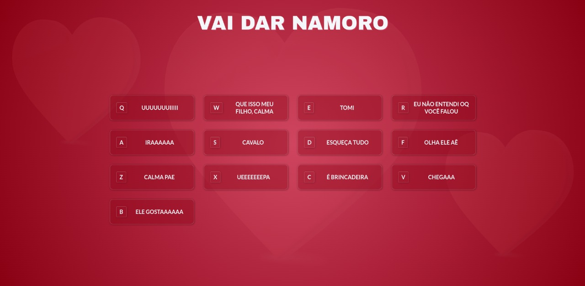

<h1 align="center">
  Sonoplastia Vai dar Namoro
</h1>

  

## 💻 Projeto
Projeto feito para replicar a sonoplastia do programa **Vai dar Namoro** no navegador. O foco da aplicação é manipular o objeto [Audio](https://developer.mozilla.org/en-US/docs/Web/API/HTMLAudioElement/Audio) do _JavaScript_ a partir do clique em botões ou dos eventos do teclado.

[Deploy do Projeto](https://sonoplastia-vai-dar-namoro.netlify.app/)

## 🚀 Tecnologias

- HTML
- CSS
- JavaScript

## 📔 Conhecimentos abordados

- [x]  Uso semântico do HTML.
- [x]  Uso de variáveis globais no `:root`.
- [x]  Uso de `flex:grid` para orientar os elementos.
- [x]  Carregando os dados de um arquivo **JSON** em uma variável.
- [x]  Manipulando o objeto `Audio` do _JavaScript_.
- [x]  Criação de elementos dinâmicos com o uso do `createElement`.

### 📺 Referência

[Vídeo](https://www.youtube.com/watch?v=7AyJVR3rL9Q)
</a>